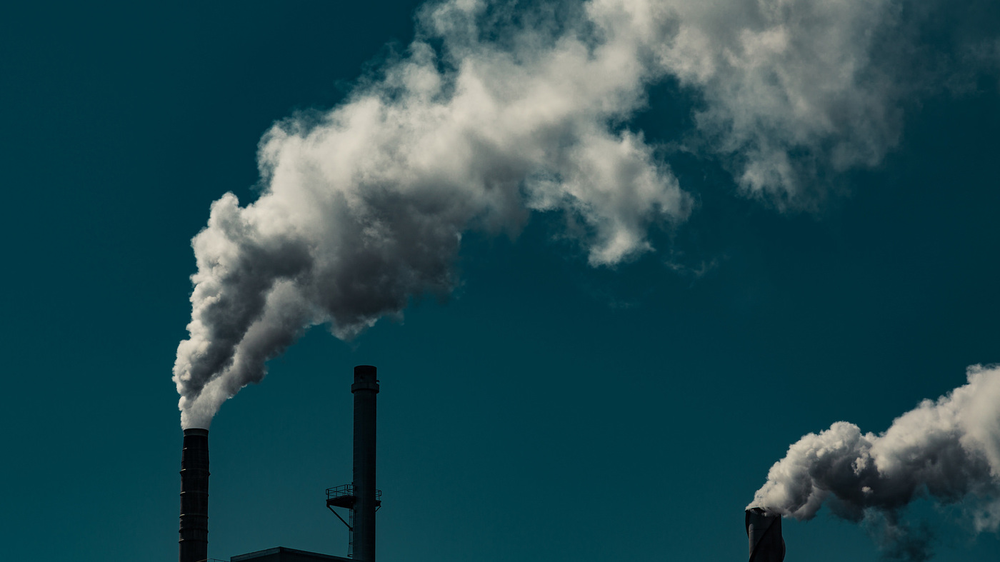

```{r,  out.width="100%"}
# Image
library(knitr)




```

Webster, Tony. J.D. Irving Smoke Stacks. 2015. Flickr

```{r, message=FALSE, warning=FALSE}
# Loading Packages and Data
library(tidyverse)
library(maps)
library(leaflet)
library(sf)


# Loads ftprint data
ftprint <- read_csv("NFA 2018.csv")

# Creating world that has geometry for all countries
world <- maps::map("world", plot = FALSE, fill = TRUE, labels = TRUE) %>%
  sf::st_as_sf() %>%
  sf::st_transform(4326) 

# Chart Theme
chart_theme <- theme(
  plot.title = element_text(family = "Arial", face = "bold", size = (12.5)), 
  legend.title = element_text(face = "italic", family = "Verdana"), 
  legend.text = element_text(face = "italic", family = "Verdana", size = (8)), 
  axis.title = element_text(family = "Arial", size = (11)),
  axis.text = element_text())


# Data Wrangling

# Renaming ftprint countries to standardize naming scheme
ftprint$`country`[ftprint$`country` == "United States of America"] <- "USA"
ftprint$`country`[ftprint$`country` == "Venezuela, Bolivarian Republic of"] <- "Venezuela"
ftprint$`country`[ftprint$`country` == "Viet Nam"] <- "Vietnam"
ftprint$`country`[ftprint$`country` == "Antigua and Barbuda"] <- "Antigua"
ftprint$`country`[ftprint$`country` == "Brunei Darussalam"] <- "Brunei"
ftprint$`country`[ftprint$`country` == "Cabo Verde"] <- "Cape Verde"
ftprint$`country`[ftprint$`country` == "Congo"] <- "Republic of Congo"
ftprint$`country`[ftprint$`country` == "Iran, Islamic Republic of"] <- "Iran"
ftprint$`country`[ftprint$`country` == "Côte d'Ivoire"] <- "Ivory Coast"
ftprint$`country`[ftprint$`country` == "Korea, Democratic People's Republic of"] <- "North Korea"
ftprint$`country`[ftprint$`country` == "Korea, Republic of"] <- "South Korea"
ftprint$`country`[ftprint$`country` == "Lao People's Democratic Republic"] <- "Laos"
ftprint$`country`[ftprint$`country` == "Libyan Arab Jamahiriya"] <- "Libya"
ftprint$`country`[ftprint$`country` == "Macedonia TFYR"] <- "Macedonia"
ftprint$`country`[ftprint$`country` == "Micronesia, Federated States of"] <- "Micronesia"
ftprint$`country`[ftprint$`country` == "USSR"] <- "Russian Federation"
ftprint$`country`[ftprint$`country` == "Russian Federation"] <- "Russia"
ftprint$`country`[ftprint$`country` == "Syrian Arab Republic"] <- "Syria"
ftprint$`country`[ftprint$`country` == "Réunion"] <- "Reunion"
ftprint$`country`[ftprint$`country` == "Tanzania, United Republic of"] <- "Tanzania"
ftprint$`country`[ftprint$`country` == "Trinidad and Tobago"] <- "Trinidad"
ftprint$`country`[ftprint$`country` == "United Kingdom"] <- "UK"
ftprint$`country`[ftprint$`country` == "Congo, Democratic Republic of"] <- "Democratic Republic of the Congo"


# DF's for Carbon Emissions for 2014:

# Select a subsection of variables from ftprint
ftprint_map_2014 <- ftprint %>% 
  select(ID = starts_with("country"), 
         year, 
         record, 
         carbon, 
         population,
         crop_land,
         built_up_land,
         fishing_ground,
         forest_land,
         grazing_land,
         UN_region,
         `Percapita GDP (2010 USD)`) %>%
  filter(record == "EFConsPerCap") %>% 
  filter(year == 2014)

# Joining world with ftprint_map
ftprint_world_sf_2014 <- world %>%
  left_join(ftprint_map_2014, by = "ID")
```

# Introduction

Global climate change may be the biggest challenge we face today. Carbon dioxide or just “carbon” emissions is one of the most important contributors to this phenomenon ^[“Climate Change Causes: A Blanket around the Earth.” Edited by Holly Shaftel , NASA, NASA, 8 Aug. 2018, climate.nasa.gov/causes/.]. The United states is the second largest contributor (behind China) releasing around 4997.50 million metric tons of carbon dioxide from fuel combustion ^[“Each Country's Share of CO2 Emissions.” Union of Concerned Scientists, www.ucsusa.org/global-warming/science-and-impacts/science/each-countrys-share-of-co2.html#.XBWbj9PwbaY.]. We can observe the trends for resource distribution and carbon emissions around the globe to help us better understand how climate change and ecological issues might shape our future. 

```{r, message=FALSE, warning=FALSE} 
# Create interactive map of world countries for different data types

# Creating Palettes
pal_carbon <- colorQuantile("YlOrRd", NULL, n = 9)

pal_GDP <- colorQuantile("YlOrBr", NULL, n = 9)

pal_built <- colorQuantile("Purples", NULL, n = 9)

pal_crop <- colorQuantile("PuBuGn", NULL, n = 9)

pal_fish <- colorQuantile("Blues", NULL, n = 9)

pal_forest <- colorQuantile("YlGn", NULL, n = 9)

pal_graz <- colorQuantile("Reds", NULL, n = 9)

# Creating Popups
carbon_em_2014_pop <- paste0(ftprint_world_sf_2014$ID, 
                             "<br><strong>Carbon Emissions (gha): </strong>", 
                             ftprint_world_sf_2014$carbon)

gdp_pop <- paste0(ftprint_world_sf_2014$ID, 
                  "<br><strong>GDP per Capita: </strong>", "$", 
                  ftprint_world_sf_2014$`Percapita GDP (2010 USD)`)

built_up_land_pop <- paste0(ftprint_world_sf_2014$ID, 
                            "<br><strong>Built Up Land (ha): </strong>", 
                            ftprint_world_sf_2014$built_up_land)

crop_land_pop <- paste0(ftprint_world_sf_2014$ID, 
                        "<br><strong>Cropland (ha): </strong>", 
                        ftprint_world_sf_2014$crop_land)

fishing_ground_pop <- paste0(ftprint_world_sf_2014$ID, 
                             "<br><strong>Fishing Ground (ha): </strong>", 
                             ftprint_world_sf_2014$fishing_ground)

forest_land_pop <- paste0(ftprint_world_sf_2014$ID, 
                          "<br><strong>Forest Land (ha): </strong>", 
                          ftprint_world_sf_2014$forest_land)

grazing_land_pop <- paste0(ftprint_world_sf_2014$ID, 
                           "<br><strong>Grazing Land (ha): </strong>", 
                           ftprint_world_sf_2014$grazing_land)

# The Map
leaflet(ftprint_world_sf_2014) %>%
  setView(lng = 0, lat = 10, zoom = 1.49) %>%
  addProviderTiles("CartoDB.Positron") %>%
  addPolygons(fillColor = ~pal_carbon(carbon),                # Adds Polygons with carbon data (2014) 
              fillOpacity = 0.9, 
              color = "#BDBDC3", 
              weight = 1,
              smoothFactor = 0.5,
              popup = carbon_em_2014_pop, 
              group = "Carbon Emissions") %>%
  addPolygons(fillColor = ~pal_GDP(`Percapita GDP (2010 USD)`),           # Adds Polygons with GDP (2014)
              fillOpacity = 0.9, 
              color = "#BDBDC3", 
              weight = 1,
              smoothFactor = 0.5,
              popup = gdp_pop, 
              group = "GDP Per Capita") %>%
  addPolygons(fillColor = ~pal_built(built_up_land),            # Adds Polygons with Built up land (2014)
              fillOpacity = 0.9, 
              color = "#BDBDC3", 
              weight = 1,
              smoothFactor = 0.5,
              popup = built_up_land_pop, 
              group = "Built Up Land") %>%
  addPolygons(fillColor = ~pal_crop(crop_land),                     # Adds Polygons with Cropland (2014)
              fillOpacity = 0.9, 
              color = "#BDBDC3", 
              weight = 1,
              smoothFactor = 0.5,
              popup = crop_land_pop, 
              group = "Cropland") %>%
  addPolygons(fillColor = ~pal_fish(fishing_ground),          # Adds Polygons with Fishing Ground (2014)
              fillOpacity = 0.9, 
              color = "#BDBDC3", 
              weight = 1,
              smoothFactor = 0.5,
              popup = fishing_ground_pop, 
              group = "Fishing Ground") %>%
  addPolygons(fillColor = ~pal_forest(forest_land),             # Adds Polygons with Forest land (2014) 
              fillOpacity = 0.9, 
              color = "#BDBDC3", 
              weight = 1,
              smoothFactor = 0.5,
              popup = forest_land_pop, 
              group = "Forest Land") %>%
  addPolygons(fillColor = ~pal_graz(grazing_land),             # Adds Polygons with Grazing land (2014)
              fillOpacity = 0.9, 
              color = "#BDBDC3", 
              weight = 1,
              smoothFactor = 0.5,
              popup = grazing_land_pop, 
              group = "Grazing Land") %>%
  addLayersControl(
    baseGroups = c("Carbon Emissions", "GDP Per Capita", "Built Up Land", "Cropland", "Fishing Ground", "Forest Land", "Grazing Land"),
    options = layersControlOptions(collapsed = FALSE)
  )
```
The 2014 carbon emissions per capita for each country, and resource distribution per capita in global hectares is shown above where darker colors represent higher rates of emission per person, or higher levels of resource distribution per person. GDP per capita for each country, correlating to economic development, is also shown. 

# Background Information

Carbon emissions, built up land (land covered in human infrastructure), cropland, fishing grounds, forest land, and grazing land are all measured in global hectares or gha per capita. This allows for the direct comparison of the amount of carbon emissions, and how resources are distributed between countries regardless of size or population. 

A global hectare (gha) is a unit that defines the average productivity in a given year of the biologically productive land and sea area. Biologically productive areas include cropland and forests, but not areas like glaciers and the open ocean. 

# Today's Trends

Grazing lands center around the equator, where forest and croplands tend to settle above and below it. Fishing grounds tend to locate on islands and hug the coasts. Countries with high carbon emission rates, tend to be those with more crop and forest land per capita as well as the highest GDP per capita. 

Most of the largest contributors to global carbon emissions are those countries that harbor the most people, as would make sense given they support the most individuals. This is why it's crucial that we look at rates of carbon emission per capita, because it's those areas of highest inefficiency that need to change the most.
